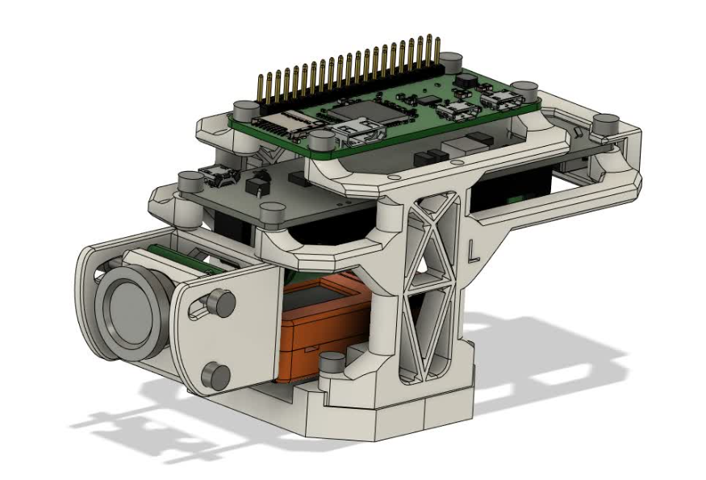

# CAD, ELE, FW, HOW-TO

# Pi-Side Setup

0. flash Raspbian Lite (32-bit) onto SD Card (class 10 recommended), then run

    `sudo apt-get update && sudo apt-get upgrade -y`

    - expand filesystem, adjust settings, hostname, enable SSH etc
    
    `sudo raspi-config`
    
    - adjust network settings: Wifi, etc

1. get the repo to the pi

    `git clone https://github.com/mbz4/edu_teleop_demo.git`

2. to start streaming, running the following python script 

    `Blueprints/stream_mjpeg_ws.py`

    - it configures the camera using picamera2
    - prepares a byte buffer in memory
    - starts a websocket server at:

        `ws://<PI-IP>:3333`
    
    - once a client connects
        
        - it sends individual JPEG frames from picamera2 output buffer

# VR setup

1. get scene apk to your Meta Quest 2

    - once loaded you can use controller thumbsticks to rotate, navigate the AR scene
        - behind you is a terminal window
        - you can set the websocket URI address here - input just the Pi IP:

        `PI_IP > PI_IP_ADDRESS_IN_YOUR_LOCAL_NETWORK`

        - (make sure you are connected to the same network as the pi is)
    - disable space sense
    
2. run apk

# M5 Rover C setup

1. print mod kit file 

    - gcode (sliced for Prusa MK3S) found at:

    `Blueprints/CAD/32g_rover_mod_kit_0.3mm_PLA_MK3S_2h12m.gcode` 

    - v1 3mf model files found at:

    `Blueprints/CAD/rover_mod_kit.3mf`

2. assemble the mod kit
 
#### [Bill of materials for physical artefact](./CAD/README.md)

#### Fusion360 RoverXR assembly link [f360 assembly link](https://a360.co/4158f0r)

Please, note the above link may not function correctly if viewed on mobile.

#### v2 concept design for reference

3. flash firmware, can use Arduino IDE (M5 Stick C library)

    - connect rover M5 Stick C to PC
    - open & flash master scripts, found at:

    `Blueprints/rover_FW/Master/Master.ino`

    - disconnect from PC and install Master Stick to Rover
    - connect remote M5 Stick C to PC
    - open & flash remote controller script, found at:

    `Blueprints/rover_FW/Remote/Remote.ino`

    - disconnect from PC and install Remote Stick to Remote Controller
    - use power switches on remote & rover
    - press and hold for 4 seconds the lower left side button on both M5 Stick C's to turn them on
    - press and hold for 4 seconds the 'M5' button on Remote controller, once the Master MAC address is shown
    - rover can now be remotely operated using remote

## To-Do:

- add godot setup instructions
- add rover setup instructions
- add Quest2 setup instructions
- add rover mod kit instructions
- add pi zero flashing/config instructions