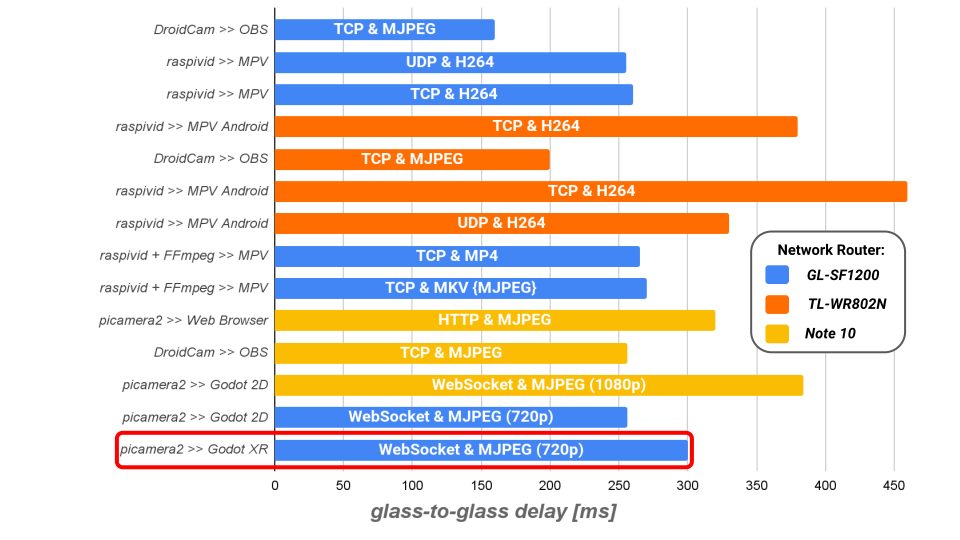

# Stream Testing

## Delay vs App, Protocol, Router

## Detailed Stream Testing Information

|Tested date |Application      |Arguments                                                                                                                                                |Network Router                                                                                                     |Frequency  Range|Measured  px2px  delay [ms]|Device source                                                                               |Source platform              |Device sink                                                                                           |Sink platform          |Sink application                                 |Sink application arguments                                                                                          |Source sensor                                                                                              |Stream Resolution|Encoding|Protocol |Git source                                                                                                          |Git sink                                                                                                                  |Comments                                                                                                                                                           |
|------------|-----------------|---------------------------------------------------------------------------------------------------------------------------------------------------------|-------------------------------------------------------------------------------------------------------------------|----------------|---------------------------|--------------------------------------------------------------------------------------------|-----------------------------|------------------------------------------------------------------------------------------------------|-----------------------|-------------------------------------------------|--------------------------------------------------------------------------------------------------------------------|-----------------------------------------------------------------------------------------------------------|-----------------|--------|---------|--------------------------------------------------------------------------------------------------------------------|--------------------------------------------------------------------------------------------------------------------------|-------------------------------------------------------------------------------------------------------------------------------------------------------------------|
|15. 03. 2023|DroidCam OBS     |tcp IP (set in OBS)                                                                                                                                      |[GL-SF1200 Dual-band gigabit Router](https://www.gl-inet.com/products/gl-sf1200/)                                  |5GHz            |160                        |[Samsung Galaxy Note10](https://www.gsmarena.com/samsung_galaxy_note10-9788.php)            |Android 12                   |[OMEN Laptop 15-en1013dx Product Specifications](https://support.hp.com/ee-en/document/c07073462#AbT0)|64-bit Ubuntu 20.04 LTS|OBS 29.0.2                                       |MJPEG, use WiFi IP, Enable audio, Allow hardware acceleration, deactivate when not showing                          |[Samsung 12M Ultrawide AF Camera Module](https://www.samsungsem.com/global/product/module/camera-module.do)|1920x1080        |MJPEG   |TCP      |[droidcam-obs-git](https://github.com/dev47apps/droidcam-obs-plugin)                                                |[obs-studio-git](https://github.com/obsproject/obs-studio)                                                                |butter smooth, crystal clear, fast                                                                                                                                 |
|15. 03. 2023|raspivid         |raspivid -fps 30 -t 0 -l -w 1920 -h 1080 -o udp://0.0.0.0:3333                                                                                           |[GL-SF1200 Dual-band gigabit Router](https://www.gl-inet.com/products/gl-sf1200/)                                  |2.4GHz          |260                        |[Raspberry Pi 4 Model B](https://www.raspberrypi.com/products/raspberry-pi-4-model-b/)      |Raspberry Pi OS (64-bit) Lite|[OMEN Laptop 15-en1013dx Product Specifications](https://support.hp.com/ee-en/document/c07073462#AbT0)|64-bit Ubuntu 20.04 LTS|mpv_0.35.1+fruit.2_amd64.deb 2023-01-30          |mpv --hwdec=auto --cache=no --no-correct-pts --fps=30 --profile=low-latency --opengl-glfinish=yes udp://0.0.0.0:3333|Sony IMX219                                                                                                |1920x1080        |H264    |UDP      |[raspivid-git](https://github.com/raspberrypi/userland/blob/master/host_applications/linux/apps/raspicam/RaspiVid.c)|[mpv-player-git](https://github.com/mpv-player/mpv)                                                                       |stable, lossy when shaken                                                                                                                                          |
|15. 03. 2023|raspivid         |raspivid -fps 30 -t 0 -l -w 1920 -h 1080 -o tcp://0.0.0.0:3333                                                                                           |[GL-SF1200 Dual-band gigabit Router](https://www.gl-inet.com/products/gl-sf1200/)                                  |2.4GHz          |260                        |[Raspberry Pi Zero W](https://www.raspberrypi.com/products/raspberry-pi-zero-w/)            |Raspberry Pi OS (32-bit) Lite|[OMEN Laptop 15-en1013dx Product Specifications](https://support.hp.com/ee-en/document/c07073462#AbT0)|64-bit Ubuntu 20.04 LTS|mpv_0.35.1+fruit.2_amd64.deb 2023-01-30          |mpv --cache=no --no-correct-pts --fps=30 --profile=low-latency tcp://192.168.8.163:3333                             |Sony IMX219                                                                                                |1920x1080        |H264    |TCP      |[raspivid-git](https://github.com/raspberrypi/userland/blob/master/host_applications/linux/apps/raspicam/RaspiVid.c)|[mpv-player-git](https://github.com/mpv-player/mpv)                                                                       |smooth, stable                                                                                                                                                     |
|16. 03. 2023|raspivid         |raspivid -fps 30 -t 0 -l -w 1920 -h 1080 -o tcp://0.0.0.0:3333                                                                                           |[TL-WR802N 300Mbps N Nano Router](https://www.tp-link.com/us/home-networking/wifi-router/tl-wr802n/#specifications)|2.4GHz          |380                        |[Raspberry Pi 3 Model B+](https://www.raspberrypi.com/products/raspberry-pi-3-model-b-plus/)|Raspberry Pi OS (64-bit) Lite|[Samsung Galaxy Note10](https://www.gsmarena.com/samsung_galaxy_note10-9788.php)                      |Android 12             |mpv-android 2023-02-27-release                   |mpv --cache=no --no-correct-pts --fps=30 --profile=low-latency tcp://<source device LAN IP>:3333                    |Sony IMX219                                                                                                |1920x1080        |H264    |TCP      |[raspivid-git](https://github.com/raspberrypi/userland/blob/master/host_applications/linux/apps/raspicam/RaspiVid.c)|[mpv-android-git](https://github.com/mpv-android/mpv-android)                                                             |slightly jittery, borderline unstable  [pi-camera#hardware-specification](https://www.raspberrypi.com/documentation/accessories/camera.html#hardware-specification)|
|17. 03. 2023|DroidCam OBS     |tcp IP (set in OBS)                                                                                                                                      |[TL-WR802N 300Mbps N Nano Router](https://www.tp-link.com/us/home-networking/wifi-router/tl-wr802n/#specifications)|2.4GHz          |200                        |[Samsung Galaxy Note10](https://www.gsmarena.com/samsung_galaxy_note10-9788.php)            |Android 12                   |[OMEN Laptop 15-en1013dx Product Specifications](https://support.hp.com/ee-en/document/c07073462#AbT0)|64-bit Windows         |OBS 29.0.2                                       |MJPEG, use WiFi IP, Enable audio, Allow hardware acceleration, deactivate when not showing                          |[Samsung 12M Ultrawide AF Camera Module](https://www.samsungsem.com/global/product/module/camera-module.do)|1920x1080        |MJPEG   |TCP      |[droidcam-obs-git](https://github.com/dev47apps/droidcam-obs-plugin)                                                |[obs-studio-git](https://github.com/obsproject/obs-studio)                                                                |smooth, fast, clear                                                                                                                                                |
|17. 03. 2023|raspivid         |raspivid -fps 30 -t 0 -l -w 1920 -h 1080 -o tcp://0.0.0.0:3333                                                                                           |[TL-WR802N 300Mbps N Nano Router](https://www.tp-link.com/us/home-networking/wifi-router/tl-wr802n/#specifications)|2.4GHz          |460                        |[Raspberry Pi Zero W](https://www.raspberrypi.com/products/raspberry-pi-zero-w/)            |Raspberry Pi OS (32-bit) Lite|[Samsung Galaxy Note10](https://www.gsmarena.com/samsung_galaxy_note10-9788.php)                      |Android 12             |mpv-android 2023-02-27-release                   |mpv --cache=no --no-correct-pts --fps=30 --profile=low-latency tcp://<source device LAN IP>:3333                    |Sony IMX219                                                                                                |1920x1080        |MKV     |TCP      |[raspivid-git](https://github.com/raspberrypi/userland/blob/master/host_applications/linux/apps/raspicam/RaspiVid.c)|[mpv-android-git](https://github.com/mpv-android/mpv-android)                                                             |felt sluggish, slow [pi-camera#hardware-specification](https://www.raspberrypi.com/documentation/accessories/camera.html#hardware-specification)                   |
|17. 03. 2023|raspivid + FFmpeg|raspivid -fps 30 -t 0 -l -w 1920 -h 1080 -o udp://0.0.0.0:3333                                                                                           |[TL-WR802N 300Mbps N Nano Router](https://www.tp-link.com/us/home-networking/wifi-router/tl-wr802n/#specifications)|2.4GHz          |330                        |[Raspberry Pi Zero W](https://www.raspberrypi.com/products/raspberry-pi-zero-w/)            |Raspberry Pi OS (32-bit) Lite|[Samsung Galaxy Note10](https://www.gsmarena.com/samsung_galaxy_note10-9788.php)                      |Android 12             |mpv-android 2023-02-27-release                   |mpv --cache=no --no-correct-pts --fps=30 --profile=low-latency udp://<source device LAN IP>:3333                    |Sony IMX219                                                                                                |1920x1080        |MKV     |UDP      |[raspivid-git](https://github.com/raspberrypi/userland/blob/master/host_applications/linux/apps/raspicam/RaspiVid.c)|[mpv-android-git](https://github.com/mpv-android/mpv-android)                                                             |jittery, slow  [pi-camera#hardware-specification](https://www.raspberrypi.com/documentation/accessories/camera.html#hardware-specification)                        |
|05. 04. 2023|raspivid + FFmpeg|raspivid -vf -hf -fps 30 -t 0 -l -w 1920 -h 1080 --codec MJPEG -o - &#124;  ffmpeg -i - -vcodec copy -flush_packets 0 -listen 1 -f matroska udp://0.0.0.0:3333|[GL-SF1200 Dual-band gigabit Router](https://www.gl-inet.com/products/gl-sf1200/)                                  |2.4GHz          |260                        |[Raspberry Pi Zero W](https://www.raspberrypi.com/products/raspberry-pi-zero-w/)            |Raspberry Pi OS (32-bit) Lite|[OMEN Laptop 15-en1013dx Product Specifications](https://support.hp.com/ee-en/document/c07073462#AbT0)|64-bit Windows         |mpv-x86_64-v3-20230514                           |mpv --demuxer-thread=no --vd-lavc-threads=1 --untimed --no-correct-pts "udp://192.168.199.228:3333"                 |Sony IMX219                                                                                                |1920x1080        |MP4     |UDP      |[raspivid-git](https://github.com/raspberrypi/userland/blob/master/host_applications/linux/apps/raspicam/RaspiVid.c)|[mpv-player-git](https://github.com/mpv-player/mpv)                                                                       |responsive, lossy when shaken                                                                                                                                      |
|05. 04. 2023|raspivid         |raspivid -vf -hf -fps 30 -t 0 -l -w 1920 -h 1080 --codec MJPEG -o - &#124;  ffmpeg -i - -vcodec copy -flush_packets 0 -listen 1 -f matroska tcp://0.0.0.0:3333|[GL-SF1200 Dual-band gigabit Router](https://www.gl-inet.com/products/gl-sf1200/)                                  |2.4GHz          |210                        |[Raspberry Pi Zero W](https://www.raspberrypi.com/products/raspberry-pi-zero-w/)            |Raspberry Pi OS (32-bit) Lite|[OMEN Laptop 15-en1013dx Product Specifications](https://support.hp.com/ee-en/document/c07073462#AbT0)|64-bit Windows         |mpv-x86_64-v3-20230514                           |mpv --demuxer-thread=no --vd-lavc-threads=1 --untimed --no-correct-pts "tcp://192.168.199.228:3333"                 |Sony IMX219                                                                                                |1920x1080        |MP4     |TCP      |[raspivid-git](https://github.com/raspberrypi/userland/blob/master/host_applications/linux/apps/raspicam/RaspiVid.c)|[mpv-player-git](https://github.com/mpv-player/mpv)                                                                       |fast, smooth, sometimes stutters                                                                                                                                   |
|28. 04. 2023|picamera2        |1080p, 30fps, medium JPEG quality (18Mbps)                                                                                                               |[Samsung Galaxy Note10](https://www.gsmarena.com/samsung_galaxy_note10-9788.php)                                   |2.4GHz          |320                        |[Raspberry Pi Zero W](https://www.raspberrypi.com/products/raspberry-pi-zero-w/)            |Raspberry Pi OS (32-bit) Lite|[OMEN Laptop 15-en1013dx Product Specifications](https://support.hp.com/ee-en/document/c07073462#AbT0)|64-bit Windows         |Brave Browser v1.52.64  (Chromium 112.0.5615.165)|N/A                                                                                                                 |Sony IMX219                                                                                                |1920x1080        |MJPEG   |HTTP     |[picamera2/mjpeg_server.py](https://github.com/raspberrypi/picamera2/blob/main/examples/mjpeg_server.py)            |[Brave-browser-git](https://github.com/brave/brave-browser)                                                               |responsive, fast, smooth, clear                                                                                                                                    |
|28. 04. 2023|DroidCam OBS     |tcp IP (set in OBS)                                                                                                                                      |[Samsung Galaxy Note10](https://www.gsmarena.com/samsung_galaxy_note10-9788.php)                                   |2.4GHz          |256                        |[Samsung Galaxy Note10](https://www.gsmarena.com/samsung_galaxy_note10-9788.php)            |Android 12                   |[OMEN Laptop 15-en1013dx Product Specifications](https://support.hp.com/ee-en/document/c07073462#AbT0)|64-bit Windows         |OBS 29.0.2                                       |MJPEG, use WiFi IP, Enable audio, Allow hardware acceleration, deactivate when not showing                          |[Samsung 12M Ultrawide AF Camera Module](https://www.samsungsem.com/global/product/module/camera-module.do)|1920x1080        |MJPEG   |TCP      |[droidcam-obs-git](https://github.com/dev47apps/droidcam-obs-plugin)                                                |[obs-studio-git](https://github.com/obsproject/obs-studio)                                                                |fast, smooth, crystal clear                                                                                                                                        |
|29. 04. 2023|picamera2        |1080p, 30fps, Low JPEG quality (6Mbps)                                                                                                                   |[Samsung Galaxy Note10](https://www.gsmarena.com/samsung_galaxy_note10-9788.php)                                   |2.4GHz          |384                        |[Raspberry Pi Zero W](https://www.raspberrypi.com/products/raspberry-pi-zero-w/)            |Raspberry Pi OS (32-bit) Lite|[OMEN Laptop 15-en1013dx Product Specifications](https://support.hp.com/ee-en/document/c07073462#AbT0)|64-bit Windows         |Godot_v4.0.2-stable_win64.exe                    |1080p                                                                                                               |Sony IMX219                                                                                                |1920x1080        |MJPEG   |WebSocket|[stream_mjpeg_ws.py](https://github.com/mbz4/RoverXR/blob/main/Blueprints/stream_mjpeg_ws.py)                       |[Blueprints/Testing/websocket_2_py_demo](https://github.com/mbz4/RoverXR/tree/main/Blueprints/Testing/websocket_2_py_demo)|sluggish, clear                                                                                                                                                    |
|09. 05. 2023|picamera2        |720p, 30fps, Low JPEG quality (6Mbps)                                                                                                                    |[GL-SF1200 Dual-band gigabit Router](https://www.gl-inet.com/products/gl-sf1200/)                                  |2.4GHz          |256                        |[Raspberry Pi Zero W](https://www.raspberrypi.com/products/raspberry-pi-zero-w/)            |Raspberry Pi OS (32-bit) Lite|[OMEN Laptop 15-en1013dx Product Specifications](https://support.hp.com/ee-en/document/c07073462#AbT0)|64-bit Windows         |Godot_v4.0.2-stable_win64.exe                    |720p                                                                                                                |                                                                                                           |1280x720         |MJPEG   |WebSocket|[stream_mjpeg_ws.py](https://github.com/mbz4/RoverXR/blob/main/Blueprints/stream_mjpeg_ws.py)                       |[Blueprints/Testing/websocket_2_py_demo](https://github.com/mbz4/RoverXR/tree/main/Blueprints/Testing/websocket_2_py_demo)|responsive, little blurry                                                                                                                                          |

