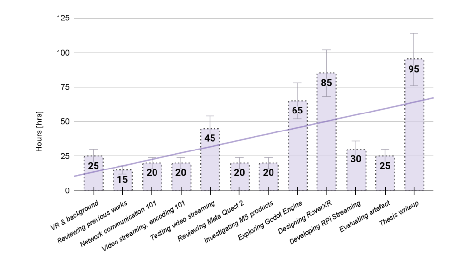

# Extended Thesis Workload Analysis

|Task                                      |Description                                                                                                                                                                                                                                                                                                                                                                                                                                                                                                                                                                                                                                      |Time  Invested  [hrs]|
|------------------------------------------|-------------------------------------------------------------------------------------------------------------------------------------------------------------------------------------------------------------------------------------------------------------------------------------------------------------------------------------------------------------------------------------------------------------------------------------------------------------------------------------------------------------------------------------------------------------------------------------------------------------------------------------------------|---------------------|
|VR & background                           |- read:  “The VR Book: Human-Centered Design for Virtual Reality” by Jason Jerald - preliminary literature review - understanding teleoperation, motivation - isolating problem statement                                                                                                                                                                                                                                                                                                                                                                                                                                                        |25                   |
|Reviewing previous works                  |- reviewing previous teleoperation thesis works - experience teleoperating & developing with Donkey Car S1 - studying artefact implementations in previous works - formulating preliminary objectives                                                                                                                                                                                                                                                                                                                                                                                                                                            |15                   |
|Network communication 101                 |- reviewing network communication protocols - WebRTC, WebSockets, UDP, RTSP, TCP - studying associated documentation - collecting example implementations on github - testing basic UDP, TCP, WebSocket communication with Python                                                                                                                                                                                                                                                                                                                                                                                                                |20                   |
|Video streaming, encoding 101             |- learning about how video streaming works - exploring picamera & picamera2 library implementation - exploring, collecting ESP32-CAM streaming solutions - learning about video encoding & codecs - learning about video streaming                                                                                                                                                                                                                                                                                                                                                                                                               |20                   |
|Testing video streaming                   |- testing DietPi Motion Eye video streaming w/ RPi 3B+ - testing ESP32-CAM video streaming - testing DroidCam & DroidCam OBS plugin - testing raspivid video streaming using TCP and using UDP - testing picamera & picamera2/libcamera video capture - collecting documentation - assessing viability - learning with MPV video player - experimenting with MPV video player - measuring latency using Droste effect & stopwatch                                                                                                                                                                                                                |45                   |
|Reviewing Meta Quest 2                    |- reviewing specificatons - learning about VR HMDs - getting familiar with the virtual environment - setting up development environment                                                                                                                                                                                                                                                                                                                                                                                                                                                                                                          |20                   |
|Investigating M5 products                 |- understanding M5 products & value - studying Rover C Pro & Joy C Remote implementation - collecting documentation, various example projects - exploring library examples - studying rover UDP control communication solution - exploring UI Flow & M5 Burner utilities - testing various example rover & remote configurations - developing servo control feature                                                                                                                                                                                                                                                                              |20                   |
|Exploring Godot Engine                    |- getting familiar with Godot Engine v3 & v4 - watching various tutorials - trying various demonstration projects - developing own learning/test projects - exploring documentation - testing, exploring example solutions - understanding development flow - getting familiar with interface - exploring GDScript - learning about OpenXR, WebXR, Godot-xr-tools - troubleshooting development issues - learning about Android development, incl. Gradle & ADB - communicating on Godot Engine official discord server - preparing demo communication projects - developing VR scene - developing AR scene - developing final frictionless scene|65                   |
|Designing RoverXR                         |- layout, design brainstorming - component selection & testing - extracting key design requirements - development environment setup - collecting 3D models - preparing reference base model - validating reference base model - designing initial solution - iterating initial solution - test print & validating - printing, assembling, testing v1 - breakout board development - isolating improvement focus areas - iterating v1 towards v2, adding/improving features - printing, assembling, testing v2                                                                                                                                    |85                   |
|Developing RPi Streaming                  |- preparing Raspberry Pi Zero 1 W - testing power consumption - configuring development environment - testing compute capabilities - developing streaming solution                                                                                                                                                                                                                                                                                                                                                                                                                                                                               |30                   |
|Evaluating artefact                       |- planning evaluation - assembling evaluation checklist - outlining evaluation objectives - preparing survey - collecting, assembling data - analyzing results                                                                                                                                                                                                                                                                                                                                                                                                                                                                                   |25                   |
|Thesis writeup                            |- planning writeup - collecting materials, notes etc - writeup & iterations                                                                                                                                                                                                                                                                                                                                                                                                                                                                                                                                                                      |120                  |
|Total tasks completed  Total time invested|12                                                                                                                                                                                                                                                                                                                                                                                                                                                                                                                                                                                                                                               |490                  |

